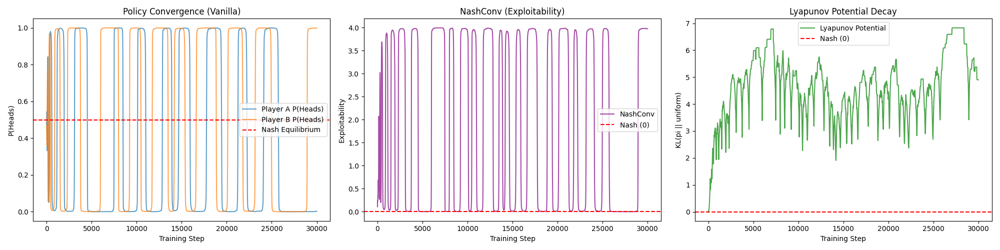
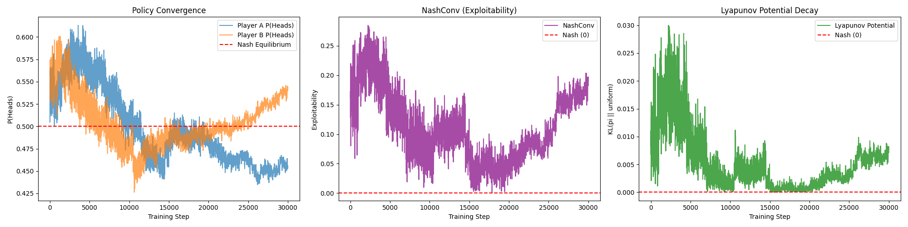

# Matching Pennies - R-NaD

Two RL agents learn to play the zero-sum game **Matching Pennies** using **Regularized Nash Dynamics (R-NaD)**, converging to the Nash equilibrium (50/50 mixed strategy).

## The Game

- Player A and Player B simultaneously choose Heads or Tails
- **Same** = Player A wins (+1 for A, -1 for B)
- **Different** = Player B wins (-1 for A, +1 for B)
- **Nash equilibrium**: both players play 50/50

## Approach

Each player is a small MLP that outputs a probability distribution over {Heads, Tails}. Both agents are trained with REINFORCE (policy gradient).

### The Problem: Cycling (Vanilla REINFORCE)

With vanilla REINFORCE, the agents cycle endlessly -- policies slam between 0 and 1, NashConv spikes to ~4.0, and the Lyapunov potential never decays. This is replicator dynamics in action.



### The Fix: R-NaD

R-NaD adds a KL divergence penalty toward a periodically-updated reference policy. This acts as "friction" that dampens oscillations, enabling convergence to Nash.

- **Inner loop**: policy gradient + KL penalty toward frozen reference
- **Outer loop**: periodically update reference to current policy



### Results Comparison

| Metric | Vanilla REINFORCE | R-NaD |
|---|---|---|
| P(Heads) range | 0.0 - 1.0 (wild swings) | 0.42 - 0.60 (near Nash) |
| NashConv (exploitability) | Spikes to ~4.0 | Hovers around 0.05 - 0.15 |
| Lyapunov potential | ~3.0 - 4.0 (no decay) | ~0.0 - 0.03 (near zero) |

## Run

```bash
python training-vanilla.py   # Vanilla REINFORCE (cycling)
python training-RNaD.py      # R-NaD (convergence)
```
